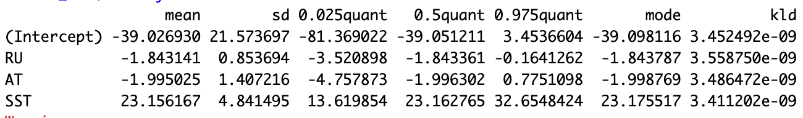
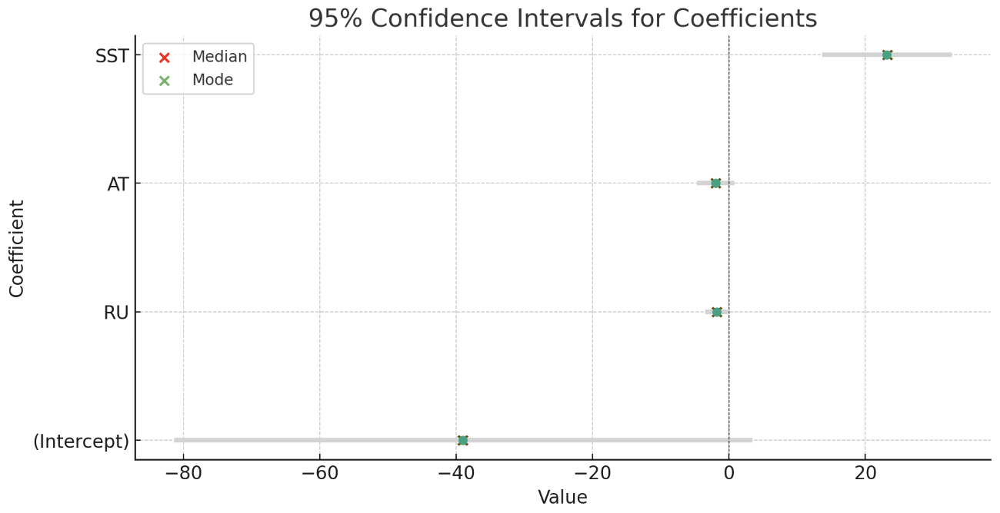
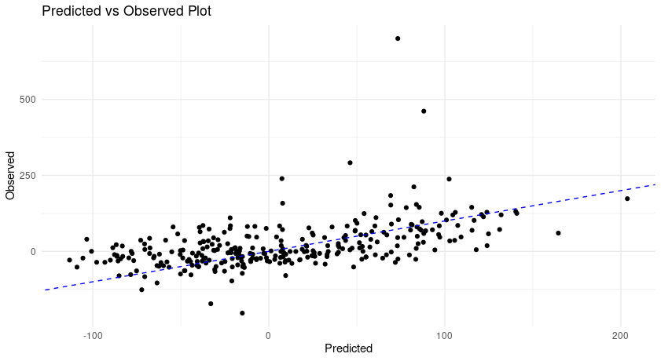
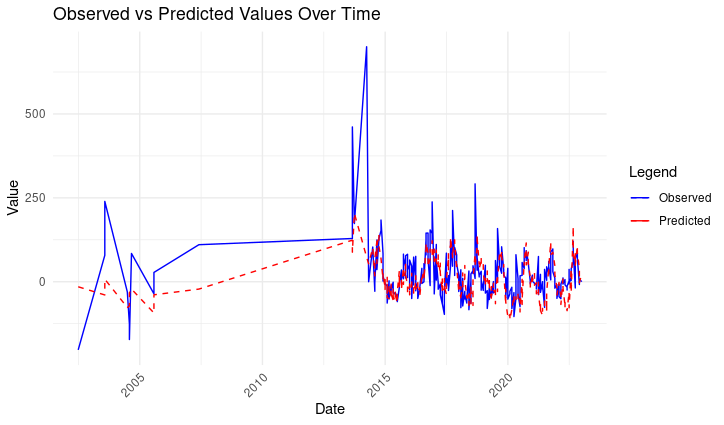

# Introduction

This tutorial will guide you through the process of performing a simple linear regression using the inlabru and fdmr packages in R. 

# Loading the INLA Package
Load the necessary packages as follows:

```{r, message=FALSE}
library(INLA)
library(tidyverse)
```

# The Data

- For this tutorial, we will use a dataset including envrionmental variables measured in Svalbard. Specifically we want to check the controlling climatic parameters for calving front variability (length change) of tidewater glaciers in Svalbard.
- We use six tidewater glaciers to demonstrate this
- Variables include surface runoff, surface mass balance, surface meltwater production, air temperature, sea surface temperature, subsurface ocean temperature

The location of the tidewater glaciers are shown below. 

```{r}
# Firstly retrieve the data
calving_data <- read.csv("4DM_Calving_NEW.csv")

# visualize the glacier location
glacierNames <- unique(calving_data[c("glacierName")])
lats <- unique(calving_data[c("latitude")])
lons <- unique(calving_data[c("longitude")])

glac1 <- list(longitude = lons[0, ], latitude = lats[0, ], label = glacierNames[0, ])
glac2 <- list(longitude = lons[1, ], latitude = lats[1, ], label = glacierNames[1, ])
glac3 <- list(longitude = lons[2, ], latitude = lats[2, ], label = glacierNames[2, ])
glac4 <- list(longitude = lons[3, ], latitude = lats[3, ], label = glacierNames[3, ])
glac5 <- list(longitude = lons[4, ], latitude = lats[4, ], label = glacierNames[4, ])

glac6 <- list(longitude = lons[5, ], latitude = lats[5, ], label = glacierNames[5, ])

points <- list(glac1, glac2, glac3, glac4, glac5, glac6)
markers <- dplyr::bind_rows(points)

fdmr::retrieve_tutorial_data(dataset = "hydro")
norway_polygon_path <- fdmr::get_tutorial_datapath(dataset = "hydro", filename = "Kvilldal_Catch_Boundary.geojson")
norway_polygon <- sf::read_sf(norway_polygon_path) %>% sf::st_zm()
sfc <- sf::st_transform(norway_polygon, crs = "+proj=longlat +datum=WGS84")
fdmr::plot_map(polygon_data = sfc, markers = markers, polygon_fill_opacity = 0.5)
```

# Simple Linear Regression Model

We will model Calving's front change using three important factors namely: surface runoff (mmWE/day), 3m air temperature (°C), sea surface temperature (°C).

# Model Specification

We specify the model using a formula and the inla function.

```{r, eval = F}
formula <- fc ~ 0 +
  f(id.loc0, model = "iid") +
  f(id.loc0, RU, model = "iid") +
  f(id.loc0, AT, model = "iid") +
  f(id.loc0, SST, model = "iid")

# Fitting INLA
inla_fit <- inla(formula, family = "gaussian", data = calving_data, control.predictor = list(compute = TRUE))
```

# Results

We can now examine the results of our INLA model.

```{r, eval=FALSE}
fdmr::summary(result)
```


```{r, eval = F}
fdmr::plot(result)
```


# Diagnostics

Checking the diagnostics of the model fit is an important step. We can plot the residuals to check for any patterns that might suggest a poor fit.

```{r, eval = F}
fdmr::pred_vs_obs(result)
```


```{r, eval = F}
fdmr::pred_vs_obs_over_time(result)
```




